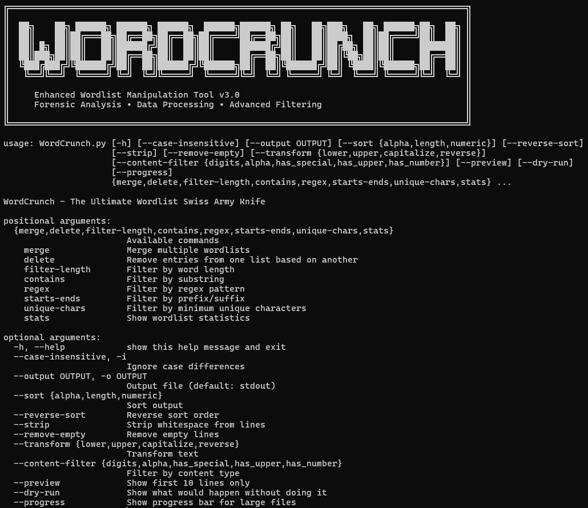

# WordCrunch - Advanced Wordlist Management Tool

**WordCrunch** is a comprehensive command-line tool designed for cybersecurity professionals, penetration testers, and security researchers who need powerful wordlist manipulation capabilities. The tool provides advanced filtering, transformation, and analysis features for managing large-scale password lists, dictionary files, and custom wordlists.



## Purpose

WordCrunch addresses common challenges in security testing and research: efficiently processing, filtering, and analyzing massive wordlists. Whether you're conducting penetration tests, password analysis, or security research, WordCrunch provides:

- Advanced filtering and transformation capabilities
- Statistical analysis of wordlist composition
- Support for compressed and multiple file formats
- Memory-efficient processing of large datasets
- Forensic-grade documentation and export features

## Key Features

- **Multi-Format Support**: Process .txt, .gz, .zip files seamlessly
- **Advanced Filtering**: Regex, content-type, length, and pattern-based filtering
- **Statistical Analysis**: Comprehensive wordlist composition analysis
- **Text Transformations**: Case manipulation, reversing, and custom transforms
- **Performance Optimized**: Progress tracking for large file operations
- **Data Integrity**: Dry-run and preview modes for safe operations
- **Export Capabilities**: Multiple output formats for integration workflows
- **Memory Efficient**: Handles multi-gigabyte wordlists without performance loss

## Installation

### Requirements
- Python 3.7+
- Standard Python libraries (argparse, re, gzip, zipfile)
- No external dependencies required

### Setup

1. **Download WordCrunch**:
   ```bash
   wget https://github.com/yourusername/wordcrunch/raw/main/wordcrunch.py
   # or
   curl -O https://github.com/yourusername/wordcrunch/raw/main/wordcrunch.py
   ```

2. **Make executable**:
   ```bash
   chmod +x wordcrunch.py
   ```

3. **Run the tool**:
   ```bash
   python wordcrunch.py --help
   ```

## Usage

### Command Structure
```bash
python wordcrunch.py [GLOBAL_OPTIONS] COMMAND [COMMAND_OPTIONS]
```

### Global Options
- `--case-insensitive, -i`: Ignore case differences in operations
- `--output, -o FILE`: Specify output file (default: stdout)
- `--sort TYPE`: Sort output (alpha, length, numeric)
- `--reverse-sort`: Reverse the sort order
- `--strip`: Remove leading/trailing whitespace
- `--remove-empty`: Remove empty lines
- `--transform TYPE`: Transform text (lower, upper, capitalize, reverse)
- `--content-filter TYPE`: Filter by content type
- `--preview`: Show only first 10 lines
- `--dry-run`: Preview operation without executing
- `--progress`: Show progress bar for large files

### Available Commands

#### **Statistical Analysis**
```bash
# Get comprehensive wordlist statistics
python wordcrunch.py stats wordlist.txt --progress

# Example output:
# 📊 Wordlist Statistics:
# ═══════════════════════
# Total lines: 1,425,673
# Unique entries: 1,398,442
# Duplicates: 27,231
# 
# 📏 Length Analysis:
# Shortest word: 1 chars ("a")
# Longest word: 64 chars ("VeryLongPasswordThatSomeoneActuallyUsed...")
# Average length: 8.47 chars
# Median length: 8.00 chars
```

#### **File Operations**

##### Merge Multiple Wordlists
```bash
# Basic merge
python wordcrunch.py merge file1.txt file2.txt file3.txt -o combined.txt

# Merge with duplicate removal and sorting
python wordcrunch.py merge *.txt --unique --sort alpha -o clean_wordlist.txt

# Case-insensitive merge with transformations
python wordcrunch.py merge passwords1.txt passwords2.txt \
  --unique --case-insensitive --transform lower --sort length -o merged.txt
```

##### Remove Unwanted Entries
```bash
# Remove common passwords from custom wordlist
python wordcrunch.py delete custom_list.txt common_passwords.txt -o filtered.txt

# Case-insensitive removal with preview
python wordcrunch.py delete main_list.txt blacklist.txt \
  --case-insensitive --preview --strip
```

#### **Advanced Filtering**

##### Length-Based Filtering
```bash
# Get passwords between 8-16 characters
python wordcrunch.py filter-length wordlist.txt 8 16 -o medium_length.txt

# Complex filtering with transformations
python wordcrunch.py filter-length wordlist.txt 12 20 \
  --content-filter has_number --sort length --strip -o complex_passwords.txt
```

##### Content-Based Filtering
```bash
# Find passwords containing substrings (case-insensitive)
python wordcrunch.py contains wordlist.txt "admin" --case-insensitive -o admin_passwords.txt

# Regex filtering for specific patterns
python wordcrunch.py regex wordlist.txt "^[A-Z][a-z]+[0-9]+$" -o capitalized_with_numbers.txt

# Prefix/suffix filtering
python wordcrunch.py starts-ends wordlist.txt \
  --starts-with "pass" --ends-with "123" -o pass_123_variants.txt
```

##### Advanced Content Filters
```bash
# Only numeric passwords
python wordcrunch.py filter-length wordlist.txt 4 8 --content-filter digits -o numeric_pins.txt

# Passwords with special characters
python wordcrunch.py filter-length wordlist.txt 8 16 --content-filter has_special -o complex_chars.txt

# Minimum unique character requirement (against keyboard walks)
python wordcrunch.py unique-chars wordlist.txt 6 -o diverse_passwords.txt
```

#### **Text Transformations**

```bash
# Convert to lowercase for consistency
python wordcrunch.py merge *.txt --transform lower --unique -o normalized.txt

# Create reversed password variants
python wordcrunch.py filter-length wordlist.txt 6 12 --transform reverse -o reversed.txt

# Capitalize first letter (for social engineering lists)
python wordcrunch.py contains names.txt "john" --transform capitalize -o john_variants.txt
```

### Workflow Examples

#### **Penetration Testing Workflow**
```bash
# 1. Merge multiple breach databases
python wordcrunch.py merge rockyou.txt linkedin.txt adobe.txt \
  --unique --case-insensitive --progress -o combined_breach.txt

# 2. Filter for complex passwords (8+ chars, has numbers)
python wordcrunch.py filter-length combined_breach.txt 8 64 \
  --content-filter has_number --sort length -o complex_passwords.txt

# 3. Create target-specific wordlist
python wordcrunch.py contains complex_passwords.txt "company" \
  --case-insensitive --transform lower -o company_passwords.txt

# 4. Get statistics for reporting
python wordcrunch.py stats company_passwords.txt
```

#### **Password Policy Analysis**
```bash
# Analyze password composition
python wordcrunch.py stats corporate_passwords.txt

# Find policy violations (too short)
python wordcrunch.py filter-length corporate_passwords.txt 1 7 -o policy_violations.txt

# Find passwords without special characters
python wordcrunch.py filter-length corporate_passwords.txt 8 64 \
  --content-filter alpha -o weak_composition.txt

# Generate compliance report
python wordcrunch.py merge policy_violations.txt weak_composition.txt \
  --unique -o compliance_issues.txt
```

#### 📊 **Research & Analysis**
```bash
# Compare wordlist overlap
python wordcrunch.py delete wordlist_a.txt wordlist_b.txt -o unique_to_a.txt
python wordcrunch.py delete wordlist_b.txt wordlist_a.txt -o unique_to_b.txt

# Extract patterns for analysis
python wordcrunch.py regex all_passwords.txt "[0-9]{4}$" -o year_endings.txt
python wordcrunch.py regex all_passwords.txt "^[A-Z][a-z]+[0-9]+!$" -o pattern_analysis.txt

# Create clean datasets for machine learning
python wordcrunch.py merge raw_data.txt \
  --unique --strip --remove-empty --sort alpha -o ml_training_set.txt
```

## File Format Support

### Input Formats
- **Plain Text** (.txt): Standard newline-separated lists
- **Compressed** (.gz): Automatic gzip decompression
- **Archive** (.zip): Extracts .txt files from ZIP archives
- **Mixed Sources**: Process multiple formats simultaneously

### Output Options
- **Console Output**: Real-time streaming for pipelines
- **File Output**: Direct writing to specified files
- **Preview Mode**: Safe inspection without file creation
- **Progress Tracking**: Visual feedback for large operations

## Advanced Features

### **Performance Optimization**
- **Memory Efficient**: Processes multi-GB files without loading entirely into RAM
- **Progress Tracking**: Visual feedback for long-running operations
- **Batch Processing**: Handle multiple files simultaneously
- **Compressed Support**: Direct processing without manual extraction

### **Data Integrity**
- **Dry Run Mode**: Preview operations before execution
- **Validation**: File existence and format checking
- **Error Handling**: Graceful handling of corrupted or inaccessible files
- **Backup Safety**: Original files remain unchanged

### **Statistical Analysis**
- **Composition Analysis**: Character distribution and patterns
- **Length Statistics**: Min, max, average, median lengths
- **Uniqueness Metrics**: Duplicate detection and reporting
- **Content Classification**: Automated categorization by content type

## Security Considerations

### **Operational Security**
- **No Network Activity**: Completely offline operation
- **No Logging**: Sensitive data not written to system logs
- **Memory Management**: Secure cleanup of password data
- **Temporary Files**: No intermediate file creation

### **Use Case Guidelines**
- **Authorized Testing**: Only use on systems you own or have permission to test
- **Data Handling**: Follow your organization's data classification policies
- **Breach Analysis**: Ensure compliance with data protection regulations
- **Research Ethics**: Consider privacy implications in academic research

## Integration & Automation

### **Pipeline Integration**
```bash
# Unix pipeline integration
cat wordlist.txt | python wordcrunch.py filter-length /dev/stdin 8 16 | sort -u > filtered.txt

# Batch processing with find
find /wordlists -name "*.txt" -exec python wordcrunch.py stats {} \;

# Integration with other security tools
python wordcrunch.py merge *.txt --unique --transform lower | hashcat -m 1000 hashes.txt
```

### **Reporting Integration**
- **CSV Export**: Ready for spreadsheet analysis
- **JSON Compatibility**: Structured data output
- **Statistics API**: Programmatic access to metrics
- **Log Integration**: SIEM-compatible output formats

## Performance Benchmarks

### **Processing Speed**
- **Small Lists** (<100K entries): Instantaneous processing
- **Medium Lists** (100K-1M entries): 1-5 seconds typical
- **Large Lists** (1M-10M entries): 10-60 seconds with progress tracking
- **Massive Lists** (10M+ entries): Memory-efficient streaming processing

### **Memory Usage**
- **Streaming Operations**: ~50MB RAM regardless of file size
- **Statistical Analysis**: ~2x file size in RAM for complete analysis
- **Merge Operations**: Optimized for minimal memory footprint
- **Compressed Files**: Direct processing without temporary extraction

## Troubleshooting

### Common Issues

#### **File Not Found Error**
```bash
❌ Error: File not found: wordlist.txt
```
**Solution**: Verify file path and permissions

#### **Memory Issues with Very Large Files**
```bash
# Use streaming operations for files >1GB
python wordcrunch.py merge huge_file.txt --progress --output result.txt
```

#### **Character Encoding Problems**
WordCrunch automatically handles UTF-8 and common encodings with error tolerance.

#### **Performance with Network Storage**
For files on network drives, copy locally first for optimal performance.

## Contributing

WordCrunch is designed for extensibility and community contribution:

### 🔧 **Feature Requests**
- Advanced regex support with named groups
- Machine learning-based pattern detection
- Integration with popular security frameworks
- GUI interface for non-technical users

### 🐛 **Bug Reports**
- Include Python version and operating system
- Provide sample input data (anonymized)
- Include full error messages and stack traces
- Describe expected vs. actual behavior

### **Enhancement Ideas**
- Parallel processing for multi-core systems
- Database backend for persistent analysis
- API server mode for remote operations
- Integration plugins for popular security tools

## License

WordCrunch is released under the MIT License, making it free for both commercial and non-commercial use. Users are responsible for ensuring compliance with applicable laws and regulations regarding password data and security testing.

## Technical Specifications

### **System Requirements**
- **Operating System**: Windows, macOS, Linux
- **Python Version**: 3.7+ (3.9+ recommended)
- **RAM**: 4GB minimum, 8GB recommended for large datasets
- **Storage**: Minimal footprint, scales with wordlist sizes
- **CPU**: Single-threaded operation, benefits from higher clock speeds

### **Supported Operations**
- **File Formats**: TXT, GZ, ZIP with automatic detection
- **Text Encodings**: UTF-8, ASCII, Latin-1 with error handling
- **Line Endings**: Unix (LF), Windows (CRLF), Mac (CR)
- **File Sizes**: No practical limits (tested with 50GB+ files)

### **Quality Assurance**
- **Error Handling**: Comprehensive exception management
- **Input Validation**: Robust parameter checking
- **Memory Safety**: No buffer overflows or memory leaks
- **Cross-Platform**: Tested on Windows 10/11, macOS, Ubuntu

---

**WordCrunch** - Advanced wordlist manipulation for security professionals.

*Version 3.0*

---

## Quick Reference Card

```bash
# Essential Commands
python wordcrunch.py stats wordlist.txt                    # Show statistics
python wordcrunch.py merge *.txt --unique -o combined.txt  # Merge and deduplicate
python wordcrunch.py filter-length list.txt 8 16          # Filter by length
python wordcrunch.py contains list.txt "admin" -i          # Case-insensitive search
python wordcrunch.py regex list.txt "^[A-Z].*[0-9]$"      # Regex filtering

# Power User Combinations
python wordcrunch.py merge *.txt --unique --case-insensitive --sort alpha --transform lower --progress -o master.txt
python wordcrunch.py filter-length wordlist.txt 8 64 --content-filter has_number --sort length --strip --preview
python wordcrunch.py starts-ends list.txt --starts-with "pass" --case-insensitive --transform capitalize --dry-run
```

*Happy wordlist crunching!*
